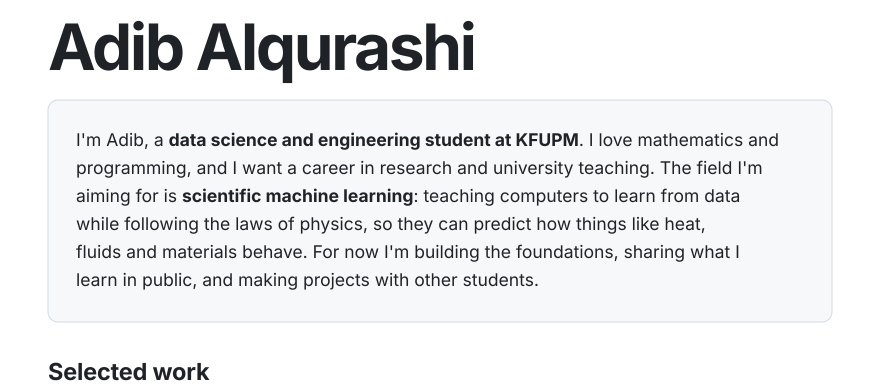
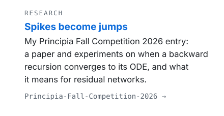
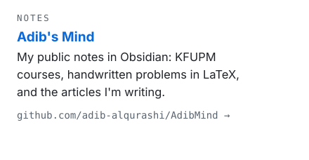
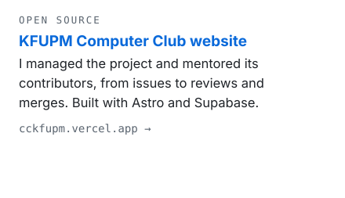

<picture><source media="(prefers-color-scheme: dark)" srcset="https://raw.githubusercontent.com/adib-alqurashi/adib-alqurashi/output/profile-head-dark.svg?v=26" /><source media="(prefers-color-scheme: light)" srcset="https://raw.githubusercontent.com/adib-alqurashi/adib-alqurashi/output/profile-head-light.svg?v=26" /></picture> 
<a href="https://github.com/adib-alqurashi/Principia-Fall-Competition-2026"><picture><source media="(prefers-color-scheme: dark)" srcset="https://raw.githubusercontent.com/adib-alqurashi/adib-alqurashi/output/profile-work-1-dark.svg?v=26" /><source media="(prefers-color-scheme: light)" srcset="https://raw.githubusercontent.com/adib-alqurashi/adib-alqurashi/output/profile-work-1-light.svg?v=26" /></picture></a><a href="https://github.com/adib-alqurashi/AdibMind"><picture><source media="(prefers-color-scheme: dark)" srcset="https://raw.githubusercontent.com/adib-alqurashi/adib-alqurashi/output/profile-work-2-dark.svg?v=26" /><source media="(prefers-color-scheme: light)" srcset="https://raw.githubusercontent.com/adib-alqurashi/adib-alqurashi/output/profile-work-2-light.svg?v=26" /></picture></a> 
<a href="https://github.com/adib-alqurashi/prototypes/tree/main/obsidian/study-timer"><picture><source media="(prefers-color-scheme: dark)" srcset="https://raw.githubusercontent.com/adib-alqurashi/adib-alqurashi/output/profile-work-3-dark.svg?v=26" /><source media="(prefers-color-scheme: light)" srcset="https://raw.githubusercontent.com/adib-alqurashi/adib-alqurashi/output/profile-work-3-light.svg?v=26" /></picture></a><a href="https://cckfupm.vercel.app"><picture><source media="(prefers-color-scheme: dark)" srcset="https://raw.githubusercontent.com/adib-alqurashi/adib-alqurashi/output/profile-work-4-dark.svg?v=26" /><source media="(prefers-color-scheme: light)" srcset="https://raw.githubusercontent.com/adib-alqurashi/adib-alqurashi/output/profile-work-4-light.svg?v=26" /></picture></a>

  <a href="mailto:adib.alqurashi@gmail.com"><picture><source media="(prefers-color-scheme: dark)" srcset="assets/btn-email-dark.svg" /></picture></a>&nbsp;
  <a href="https://www.linkedin.com/in/adib-alqurashi-347527444"><picture><source media="(prefers-color-scheme: dark)" srcset="assets/btn-linkedin-dark.svg" /></picture></a>&nbsp;
  <a href="https://x.com/adib_alqurashi"><picture><source media="(prefers-color-scheme: dark)" srcset="assets/btn-x-dark.svg" /></picture></a>

